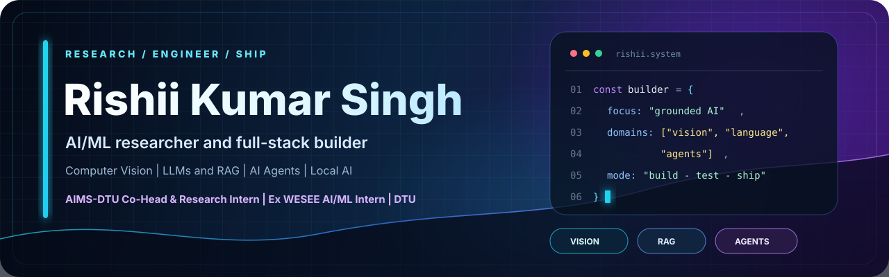
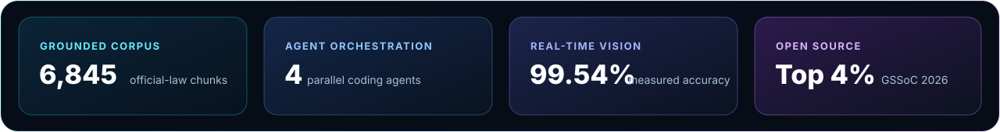
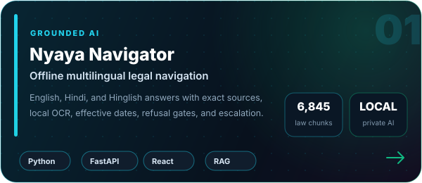
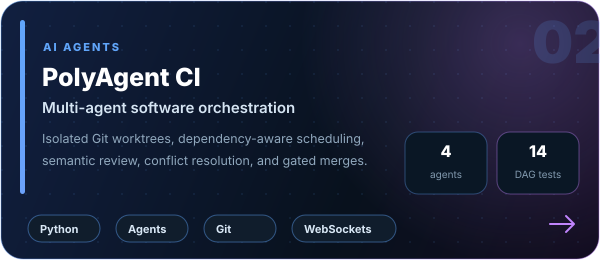
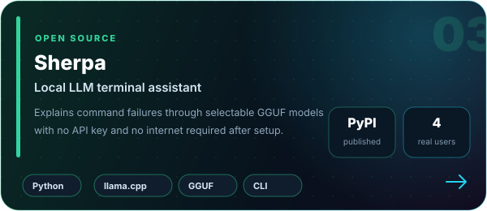
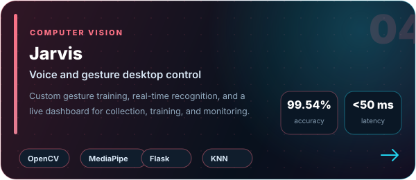
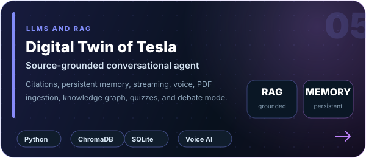
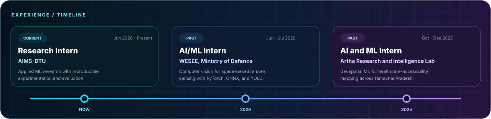
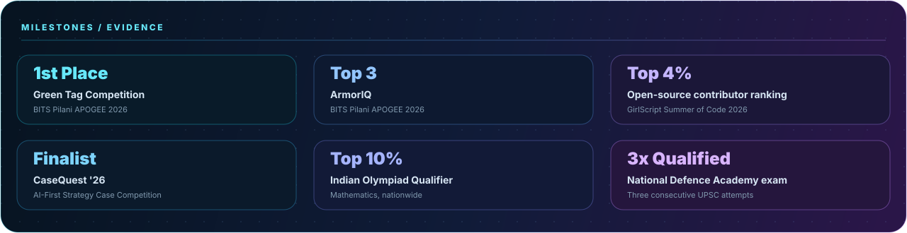

  

  
  
  
  
  

  

<h2 align="center">About</h2>

  B.Tech student at <strong>Delhi Technological University</strong>, Research Intern at <strong>AIMS-DTU</strong>, 
  and former AI/ML Intern at <strong>WESEE, Ministry of Defence, Government of India</strong>.

  I build AI systems across vision, language and local inference, with an emphasis on grounded outputs, 
  reproducible evaluation and software that survives outside a notebook.

  
  
  

<h2 align="center">Featured Systems</h2>

  
  

  
  

  

  

<strong>Project details, installation and demos</strong>

- **Nyaya Navigator:** Offline multilingual legal navigation over 6,845 official-law chunks, with claim-level source verification, effective-date checks, local OCR and unsupported-claim refusal.
- **PolyAgent CI:** Coordinates four coding agents across isolated Git worktrees through a dependency-aware DAG, semantic review, conflict resolution and test-gated merges.
- **Sherpa:** Local LLM terminal assistant published on [PyPI](https://pypi.org/project/sherpa-dev/). Install with `pip install sherpa-dev` and run without an API key or internet after setup.
- **Jarvis:** Voice and gesture desktop control trained on 3,261 samples, with 99.54% measured accuracy and recognition latency below 50 ms. [Watch the demo](https://www.youtube.com/watch?v=thcPBI7ImGQ).
- **Digital Twin of Nikola Tesla:** Source-grounded RAG agent over Tesla's writings, patents and interviews, with citations, persistent memory, voice interaction and an explorable knowledge graph.

<h2 align="center">Experience</h2>

  

<h2 align="center">Technical Stack</h2>

  

  <code>RAG</code>&nbsp;
  <code>AI agents</code>&nbsp;
  <code>local inference</code>&nbsp;
  <code>FAISS</code>&nbsp;
  <code>ChromaDB</code>&nbsp;
  <code>llama.cpp</code>&nbsp;
  <code>ONNX</code>&nbsp;
  <code>MediaPipe</code>&nbsp;
  <code>QGIS</code>

<h2 align="center">GitHub Activity</h2>

  

  

<h2 align="center">Selected Achievements</h2>

  

<strong>Selected certifications</strong>

- [Deep Learning Specialization, DeepLearning.AI](https://coursera.org/verify/specialization/WQ6EOXR8U51L)
- [Machine Learning Specialization, DeepLearning.AI](https://www.coursera.org/account/accomplishments/specialization/8JFNCYJQ96M7)
- [Data Science and AI, IIT Madras](https://drive.google.com/file/d/1VwFnCool9CxFYaS2EHMN1GT0KXpJ7vlO/view)

 

  

  

