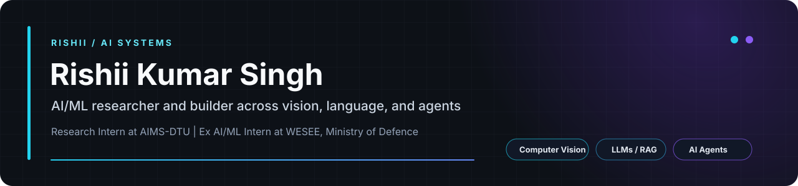

  

  <a href="https://portfolio-rishii.vercel.app/">Portfolio</a> |
  <a href="https://www.linkedin.com/in/rishiikumarsingh/">LinkedIn</a> |
  <a href="mailto:rishiikumarsingh2201@gmail.com">Email</a> |
  <a href="https://leetcode.com/u/CrimsonHex/">LeetCode</a> |
  <a href="https://x.com/RishiiSingh2201">X</a>

## What I build

I am a B.Tech student at Delhi Technological University and an AI/ML researcher and product builder. I work across computer vision, LLMs, retrieval-augmented generation, local inference, and multi-agent systems, with an emphasis on grounded outputs, reproducible evaluation, and useful software.

| Current focus | Evidence |
|---|---|
| Applied AI research | Research Intern at AIMS-DTU |
| Production-oriented computer vision | Former AI/ML Intern at WESEE, Ministry of Defence |
| Open-source engineering | GSSoC 2026 Top 4% contributor and PyPI package maintainer |
| End-to-end building | FastAPI and Python backends, React and TypeScript interfaces, deployment and evaluation |

## Selected work

### [Nyaya Navigator](https://github.com/RishiiGamer2201/Gemma_Hack)

Offline English, Hindi, and Hinglish legal navigation over **6,845 official-law chunks**. Combines lexical retrieval and local embeddings with claim-level source verification, effective-date handling, unsupported-claim refusal, urgent-case escalation, local OCR, and speech.

<code>Python</code> <code>FastAPI</code> <code>React</code> <code>RAG</code> <code>Local inference</code>

### [PolyAgent CI](https://github.com/RishiiGamer2201/polyagent-ci)

Coordinates **four coding agents** across isolated Git worktrees using a dependency-aware DAG. Implements contract-first development, semantic review, automated conflict resolution, test-gated topological merges, **14 DAG tests**, and a collaborative editor demo with synchronization under **200 ms**.

<code>Python</code> <code>FastAPI</code> <code>React</code> <code>TypeScript</code> <code>WebSockets</code> <code>Git</code>

### [Sherpa](https://github.com/RishiiGamer2201/sherpa)

A local terminal assistant published on [PyPI](https://pypi.org/project/sherpa-dev/). It explains command failures and recommends fixes using selectable GGUF language models through llama.cpp, without an API key or internet after setup. Feedback from **four external users** informed its next model-selection and evaluation plan.

    pip install sherpa-dev
    python -m sherpa

### [Jarvis](https://github.com/RishiiGamer2201/gesture-desktop-control)

Voice and gesture desktop control with ten built-in gestures and user-defined training. A KNN classifier trained on **3,261 samples** reached **99.54% measured accuracy** with recognition latency under **50 ms**. Includes a Flask and Socket.IO dashboard for data collection, training, monitoring, and process control.

[Watch the demo](https://www.youtube.com/watch?v=thcPBI7ImGQ)

### [Digital Twin of Nikola Tesla](https://github.com/RishiiGamer2201/digital-twin-tesla)

A source-grounded conversational system built over Tesla's writings, patents, and interviews. Includes visible citations, persistent memory, streamed responses, confidence labels, PDF ingestion, voice interaction, an interactive knowledge graph, quizzes, and a Tesla-versus-Edison debate mode.

<code>Python</code> <code>Flask</code> <code>ChromaDB</code> <code>SQLite</code> <code>RAG</code>

[Explore all projects](https://portfolio-rishii.vercel.app/#projects)

## Experience

**Research Intern, AIMS-DTU** | Jun 2026 - Present

Applied machine learning research with reproducible experimentation and evaluation.

**AI/ML Intern, WESEE, Ministry of Defence** | Jun 2026 - Jul 2026

Developed computer vision systems for space-based remote sensing across object detection, change detection, classification, and semantic segmentation using Python, PyTorch, ONNX, and YOLO.

**AI & ML Intern, Artha Research & Intelligence Lab** | Oct 2025 - Dec 2025

Applied geospatial analysis and machine learning to healthcare-accessibility mapping in Himachal Pradesh.

## Technical toolkit

- **Languages:** Python, C++, TypeScript, JavaScript, SQL
- **AI and ML:** PyTorch, TensorFlow, scikit-learn, Hugging Face, OpenCV, MediaPipe, ONNX
- **LLM systems:** RAG, local inference, FAISS, ChromaDB, llama.cpp, agent orchestration
- **Product engineering:** FastAPI, Flask, React, Tailwind CSS, WebSockets, SQLite, Git
- **Geospatial:** QGIS, road-network analysis, remote-sensing workflows

## Selected achievements

- **1st Place**, Green Tag Competition at BITS Pilani APOGEE 2026
- **Top 3**, ArmorIQ at BITS Pilani APOGEE 2026
- **Top 4% contributor**, GirlScript Summer of Code 2026
- **Finalist**, CaseQuest '26 AI-First Strategy Case Competition
- **Top 10% nationwide**, Indian Olympiad Qualifier in Mathematics
- **Qualified NDA three consecutive times** through UPSC

<strong>Selected certifications</strong>

- [Deep Learning Specialization, DeepLearning.AI](https://coursera.org/verify/specialization/WQ6EOXR8U51L)
- [Machine Learning Specialization, DeepLearning.AI](https://www.coursera.org/account/accomplishments/specialization/8JFNCYJQ96M7)
- [Data Science and AI, IIT Madras](https://drive.google.com/file/d/1VwFnCool9CxFYaS2EHMN1GT0KXpJ7vlO/view)

  <strong>Build things that matter. Ship things that work.</strong>

