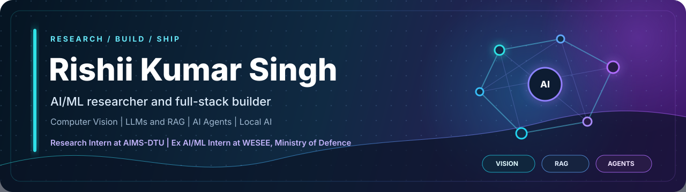

  

  
  
  
  
  

<table>
<tr>
<td align="center" width="25%"><strong>6,845</strong> official-law chunks indexed</td>
<td align="center" width="25%"><strong>4 agents</strong> orchestrated in parallel</td>
<td align="center" width="25%"><strong>99.54%</strong> measured gesture accuracy</td>
<td align="center" width="25%"><strong>Top 4%</strong> GSSoC 2026 ranking</td>
</tr>
</table>

## About me

I am a B.Tech student at **Delhi Technological University** and an AI/ML researcher and product builder based in New Delhi. I like systems where the hard part is not merely calling a model, but making the result grounded, testable, recoverable, and useful.

- Research Intern at **AIMS-DTU**
- Former AI/ML Intern at **WESEE, Ministry of Defence, Government of India**
- Building across computer vision, LLMs, RAG, local inference, and multi-agent systems
- Open to AI/ML research, software engineering, and open-source collaborations

## Featured engineering

<table>
<tr>
<td width="50%" valign="top">

### [Nyaya Navigator](https://github.com/RishiiGamer2201/Gemma_Hack)

**Offline multilingual legal navigation with verifiable answers.**

Searches **6,845 official-law chunks** across English, Hindi, and Hinglish. Adds claim-level source verification, effective-date handling, unsupported-claim refusal, urgent-case escalation, local OCR, and speech.

</td>
<td width="50%" valign="top">

### [PolyAgent CI](https://github.com/RishiiGamer2201/polyagent-ci)

**Multi-agent software development across isolated Git worktrees.**

Coordinates **four coding agents** through a dependency-aware DAG with contract-first development, semantic review, automated conflict resolution, test-gated merges, **14 DAG tests**, and editor synchronization under **200 ms**.

</td>
</tr>
<tr>
<td width="50%" valign="top">

### [Sherpa](https://github.com/RishiiGamer2201/sherpa)

**A local LLM terminal assistant published on PyPI.**

Explains command failures and recommends fixes using selectable GGUF models through llama.cpp. Runs without an API key or internet after setup. Feedback from **four external users** informed its next evaluation plan.

<code>pip install sherpa-dev</code>

</td>
<td width="50%" valign="top">

### [Jarvis](https://github.com/RishiiGamer2201/gesture-desktop-control)

**Voice and gesture desktop control.**

A KNN classifier trained on **3,261 samples** reached **99.54% measured accuracy** with recognition latency under **50 ms**. Includes ten built-in gestures, custom training, and a live Flask and Socket.IO dashboard.

</td>
</tr>
<tr>
<td colspan="2" valign="top">

### [Digital Twin of Nikola Tesla](https://github.com/RishiiGamer2201/digital-twin-tesla)

**A source-grounded conversational digital twin built over Tesla's writings, patents, and interviews.** Includes visible citations, persistent memory, streamed responses, confidence labels, PDF ingestion, voice interaction, an interactive knowledge graph, quizzes, and a Tesla-versus-Edison debate mode.

</td>
</tr>
</table>

  <a href="https://portfolio-rishii.vercel.app/#projects"><strong>Explore every project on my portfolio</strong></a>

## Experience

| Role | Organization | Dates | Work |
|---|---|---|---|
| Research Intern | AIMS-DTU | Jun 2026 - Present | Applied ML research with reproducible experimentation and evaluation |
| AI/ML Intern | WESEE, Ministry of Defence | Jun 2026 - Jul 2026 | Computer vision for space-based remote sensing using Python, PyTorch, ONNX, and YOLO |
| AI & ML Intern | Artha Research & Intelligence Lab | Oct 2025 - Dec 2025 | Geospatial ML for healthcare-accessibility mapping in Himachal Pradesh |

## Technical stack

  

  <code>RAG</code>
  <code>AI agents</code>
  <code>local inference</code>
  <code>FAISS</code>
  <code>ChromaDB</code>
  <code>llama.cpp</code>
  <code>ONNX</code>
  <code>MediaPipe</code>
  <code>QGIS</code>

## GitHub activity

  

  

## Selected achievements

<table>
<tr>
<td><strong>1st Place</strong></td>
<td>Green Tag Competition at BITS Pilani APOGEE 2026</td>
</tr>
<tr>
<td><strong>Top 3</strong></td>
<td>ArmorIQ at BITS Pilani APOGEE 2026</td>
</tr>
<tr>
<td><strong>Top 4%</strong></td>
<td>GirlScript Summer of Code 2026 contributor ranking</td>
</tr>
<tr>
<td><strong>Finalist</strong></td>
<td>CaseQuest '26 AI-First Strategy Case Competition</td>
</tr>
<tr>
<td><strong>Top 10% nationwide</strong></td>
<td>Indian Olympiad Qualifier in Mathematics</td>
</tr>
<tr>
<td><strong>3 consecutive qualifications</strong></td>
<td>NDA 2 2024, NDA 1 2025, and NDA 2 2025 through UPSC</td>
</tr>
</table>

<strong>Selected certifications</strong>

- [Deep Learning Specialization, DeepLearning.AI](https://coursera.org/verify/specialization/WQ6EOXR8U51L)
- [Machine Learning Specialization, DeepLearning.AI](https://www.coursera.org/account/accomplishments/specialization/8JFNCYJQ96M7)
- [Data Science and AI, IIT Madras](https://drive.google.com/file/d/1VwFnCool9CxFYaS2EHMN1GT0KXpJ7vlO/view)

 

  

  <strong>Build things that matter. Ship things that work.</strong>

